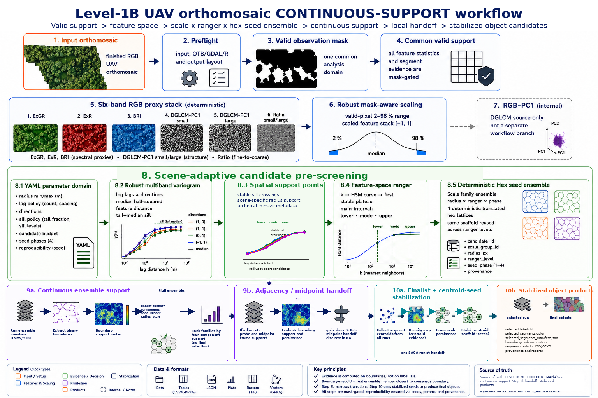

# Level-1B Method Core Map

Level-1B is the candidate-scale stability and segmentation-evidence workflow. Its logical method is implemented mostly in `metashape_qc_engine/level1b_*.py`, with orchestration in `level1b_dumb_runner.py`, environment setup in one shell wrapper, and final segment statistics in one R script.




Operational commands are in [RUN_LEVEL1B.md](RUN_LEVEL1B.md). This file maps the scientific method, principal levers, and artifact contracts.

## Method core versus wrapper

| Layer | Current code | Responsibility |
|---|---|---|
| Method steps | `level1b_valid_mask.py`, `level1b_proxy_stack_rgb_dglcm.py`, `level1b_channels.py`, `level1b_scaling.py`, `level1b_candidate_prescreening.py`, `level1b_candidate_response_surface.py`, `level1b_materialization.py` | Define domain, features, scale candidates, perturbations, response evidence, handoff, and products |
| Segment statistics | `R/level1b_step10_exactextractr_segment_stats.R` | Compute exactextractr summaries for materialized selected segments |
| Contract validation | `level1b_preflight.py`, `level1b_step_manifest.py` | Validate runtime inputs/tools and expose stable per-step input/artifact keys |
| Wrapper | `level1b_dumb_runner.py`, `run_level1b_dumb_with_user_header.sh` | Establish environment, call steps in order, enforce branch/status contracts, and write a compact report |

Scientific decisions remain in step modules. The wrapper passes explicit paths and stops when a step or manifest contract fails.

## 1. Valid mask: analysis-domain contract

`level1b_valid_mask.py` creates the binary domain used by later feature and segmentation steps. Rules can use explicit nodata values, an alpha-band threshold, and black-border rejection. Current class defaults reject all-black and all-white RGB tuples.

The mask is `level1b/mask/valid_mask.tif`; later steps receive this exact path. Pixels outside it are excluded from feature statistics, segmentation evidence, and selected-run quality evidence. Changing the mask changes the analyzed population, not merely display appearance.

## 2. Deterministic six-band RGB proxy stack

For RGB input, `level1b_proxy_stack_rgb_dglcm.py` defines and builds this exact normal-stack order. `level1b_channels.py` is the workflow adapter that validates inputs, invokes the recipe, and writes the channel artifacts:

1. `ExGR` — green/living-vegetation dominance
2. `ExR` — dry, reddish, soil, and residue component
3. `BRI` — shadow, illumination, and albedo baseline from RGB mean brightness
4. `DGLCM_PC1_SMALL` — fine directional radiometric structure on RGB-PC1
5. `DGLCM_PC1_LARGE` — coarse directional radiometric structure on RGB-PC1
6. `RATIO_DGLCM_PC1` — fine-versus-coarse directional structure

This is a deterministic RGB proxy stack for robust feature-space separation under variable UAV image quality. It is neither scene-trained nor scene-optimized. The spectral proxy bands are 1–3. Bands 4–5 are directional structure-feature bands. Band 6 is their fine-to-coarse ratio. All six bands enter the scaled feature space, but none of their names or measurement radii define the scene-adaptive Step-9a candidate ladder.

The structure path is:

1. mask RGB; valid pixels retain RGB values and invalid pixels receive the configured background value
2. reuse the repository PCA implementation with three input bands and one component
3. derive valid-PC1 2nd and 98th percentiles, clip to them, and rescale to `[0, 255]`
4. run OTB `HaralickTextureExtraction` with `texture=simple`, 32 bins, and Inertia from output band 5
5. evaluate offsets `[1,0]`, `[1,1]`, `[0,1]`, and `[-1,1]` at each metric radius
6. take the pixelwise maximum Inertia across directions separately for the small and large bands
7. compute `DGLCM_PC1_SMALL / (DGLCM_PC1_LARGE + 1e-6)`

Active radii are `dglcm_pc1_small_radius_m: 0.2` and `dglcm_pc1_large_radius_m: 0.5`. They are converted with `max(1, round(radius_m / pixel_size_m))`. Radius choice remains a methodological risk because it defines which local structure enters feature-space distances, ranger derivation, and segmentation. It does not define the segmentation candidate radii.

The previous five-channel ExGR neighborhood-variance stack and its historical `TEX_*` labels are legacy and are not the current normal RGB path. Current RGB structure is directional GLCM/Haralick Inertia on RGB-PC1, not undirected neighborhood variance.

Outputs are `level1b/channels/proxy_stack.tif` and `channel_report.json`. The report records band order, PCA quantization, offsets, radii, aggregation, and ratio metadata.

### Scientific extension point

`rgb_dglcm_pc1_band_definitions()` is the single ordered definition of the final stack bands. Each entry contains a band name and its OTB BandMathX expression. The reported `band_names` and `band_count` are derived from this list rather than duplicated in YAML or the runner.

A channel based on the existing RGB, small-structure, or large-structure inputs is added locally by appending one `(name, expression)` entry. A channel requiring a new raster operator additionally needs its intermediate command and raster added within the same recipe module. It does not require Step 9 or Step 10 changes. Scaling and candidate pre-screening receive the resulting band count from the channel result.

The normal method parameters are explicit in `config/level1b_default.yaml`: RGB band indices, metric DGLCM radii, PC1 clip quantiles and output range, GLCM bin count and directions, ratio epsilon, and background value. Fixed OTB interface facts—PCA input/component count, `texture=simple`, and Inertia output band 5—remain in the recipe code rather than being exposed as experimental YAML parameters.

## 3. Robust feature scaling

`level1b_scaling.py` masks the six-band stack, derives each band's 2nd and 98th percentiles, centers on their midpoint, scales by half their range, and clips valid values to `[-1, 1]`. Background remains separate from valid scaled values.

This reduces extreme-value influence on feature-space distances, ranger derivation, and segmentation stability. It is robust-percentile scaling, not PCA and not the commented legacy z-score branch.

Outputs include `scaled_feature_stack.tif`, `scaling_parameters.json`, `scaling_parameters.xml`, and `scaling_report.json`. The JSON records quantiles, bounds, centers, and scales.

## 4. Scene-adaptive candidate pre-screening

`level1b_candidate_prescreening.py` replaces the normal runner's former fixed
scale-distribution, ranger-assignment, and perturbation chain. The YAML now
defines an admissible radius domain and derivation policies; it does not list
concrete Step-9a scale anchors.

The pre-screen reads the valid pixels of `scaled_feature_stack.tif` and
computes a robust multiband empirical variogram over logarithmically spaced
lags. For each lag and configured direction, the response is half the mean
squared Euclidean difference between the two scaled feature vectors. The
median across sampled valid pairs and then across directions limits the
influence of extreme local differences.

The sill is the median of the configured tail fraction of the variogram.
Concrete scale support points are the first crossings of the configured sill
fractions that remain above the threshold for the configured lag window. The
active support fractions are `0.25, 0.50, 0.75, 0.95`. They are positions on
one continuous scene-structure curve, not analysis classes. Every resulting
family receives exactly the same Step-9 evaluation.

The YAML domain bounds are `radius_min_m` and `radius_max_m`. Candidate
radii are constrained to this domain and to executable raster-pixel lags.
For every selected radius, `spatialr_px` is the selected pixel lag. The lower
radius-domain bound also defines one common technical `minsize_px` provenance
value using `(2 * round_half_up(radius_min_m / pixel_size_m))²`. SAGA does not
apply this value as a post-segmentation merge threshold, and local
perturbations keep it fixed. DGLCM measurement radii and channel names do not
create the segmentation scale ladder.

Knee location, tail plateau, directional 95%-ranges, and their anisotropy
ratio are diagnostic metadata only. They do not add, remove, rank, or
differentially evaluate candidates. If fewer than two distinct stable support
radii are found, pre-screening fails rather than restoring fixed anchors.

## 5. Feature range (`ranger`)

The pre-screen reuses the existing HSM/kNN implementation from
`level1b_feature_range.py`. It evaluates the configured neighbour ranks
`[8, 10, 13, 16, 21, 27, 34, 44, 55]` on one deterministic sample of valid scaled feature
vectors. Each kNN-distance distribution is reduced by Half-Sample Mode. The
smallest k in the first stable HSM window supplies the central scene ranger.
There is no fixed-k or tail-quantile fallback.

The materialized ranger levels are the central HSM plus the positive unique
lower and upper bounds of its shortest half-sample modal interval. These are
bounded positions in the plausible main feature-distance interval, not a
ranger tail ladder. Ranger is dimensionless feature-space tolerance; it is not
a metre or pixel scale.

## 6. Materialized Step-9a population

The pre-screen writes
`level1b/candidate_pre_screening/candidate_population.json`. Each selected
spatial support point defines one `candidate_scale_group_id`. Its ranger
levels are rows in that family, with exactly one central row marked
`is_baseline=true`.

Rows contain the opaque run and family IDs, `spatialr_px`, coupled
`minsize_px`, `ranger`, explicit source radius, sill-support metadata,
variogram plausibility flags, and provenance. The configured candidate budget
is a hard cap; it does not silently truncate the population.

The same directory contains `variogram_diagnostics.json`,
`variogram_curve.csv`, and `candidate_pre_screening_report.json`.
Pre-screening performs no segmentation, ranking, or final selection. Step 9a
consumes the population JSON directly. The legacy scale-distribution,
feature-range-assignment, and initial perturbation modules remain readable for
old runs but are not called by the normal runner.

## 7. Step 9a response-surface evidence

`level1b_candidate_response_surface.py` runs or reuses one-scale segmentation for every planned perturbation. `level1b_saga_segmentation.py` materializes reusable masked SAGA feature grids and uses SAGA Seed Generation only for its multiband local-variance surface. The unconstrained variance-minimum seed output is not materialized or used. A raster-origin-anchored hexagonal lattice makes the target support-cell area equal to `pi * radius_px^2`; bounded snapping chooses local variance minima, a spatial hash enforces `radius_px` minimum seed distance, and SAGA Proximity Grid verifies a `2 * radius_px` maximum coverage distance with deterministic farthest-point completion where necessary. Seeded Region Growing then uses `SIG_1=ranger`, `SIG_2=spatialr_px`, feature-plus-position similarity, four-neighbour connectivity, and threshold zero. Each run preserves a `controlled_seed_report.json`; output IDs are shifted so label zero remains invalid support. Run-Q and Step-9 evidence are computed unchanged.

Evidence has three linked views:

- **population statistics** — segment counts and areas, size-class distributions, central/tail shares, distribution distances, compatible combinations, and medoid-run context
- **spatial response** — analysis-cell dominance, pattern agreement, persistence, and spatial distribution distances
- **stability response** — edge loading, scale jumps, distribution flutter, spatial jumps, central mass, and response spread

The raw score starts at 1.0, applies fixed penalties for edge loading, scale jumps, distribution flutter, and spatial jumps, rewards mean central-area share, and penalizes response spread. `stability_score` clamps the raw score to `[0, 1]`.

True ranking is:

1. descending `stability_score_raw`
2. descending `stability_score`
3. ascending opaque `candidate_scale_group_id` only as final tie-breaker

Candidate IDs are not scale coordinates. Scale order comes from explicit numeric metadata.

Core outputs are `run_population_summary.json`, `candidate_group_response_summary.json`, `ranked_candidate_scales.json`, `candidate_response_surface_report.json`, detailed run reports, and retained segmentation products under `level1b/candidate_response_surface/`.

## 8. Step 9b adjacency and gain-share handoff

Step-9b starts from the top two true-ranked candidates but independently orders them on the numeric scale ladder.

- Non-adjacent: write both as supported alternatives, require analyst choice, and stop before Step 10.
- Adjacent: reuse lower and upper anchors by reference, construct exactly one midpoint central candidate, and execute only its perturbation family.

After midpoint-family raw support `SM` is available:

```text
midpoint_gain_share = (SM - S2) / (S1 - S2)
```

`S1` and `S2` are rank-1 and rank-2 raw supports. The midpoint is handed forward only when the share is strictly greater than `0.5`; equality retains No1. Invalid reference gain or uninterpretable midpoint support retains No1 with a warning. This is a local support handoff, not global optimization.

Key outputs include:

- `level1b/step9b_prepare_inputs/step9b_prepare_manifest.json`
- `level1b/step9b_prepare_inputs/ranked_candidate_scales_view.json`
- `level1b/local_transition_refinement/step9b_interval_preflight.json`
- midpoint probe/perturbation files on the adjacent branch
- `step9b_supported_scale_alternatives.json` on the non-adjacent branch
- nested `midpoint_response_surface_eval/` outputs
- `step9b_midpoint_gain_share_handoff.json`

## 9. Step 10 product and quality evidence

`level1b_materialization.py` first creates one canonical finalist-evidence object recording numeric boundaries, midpoint, display order, selected candidate and baseline run, group/run rows, source paths, and aggregations. Later Step-10 parts consume it without reranking.

The selected baseline labels are copied to `selected_labels.tif` without recomputing labels, then polygonized to the `selected_segments` GeoPackage layer with `segment_id` and provenance. The R script computes exactextractr named summaries as one wide row per segment against the selected run's masked feature stack.

Final products:

- `level1b/step10_materialization/final_segments/selected_labels.tif`
- `level1b/step10_materialization/final_segments/selected_segments.gpkg`
- `level1b/step10_materialization/final_segments/selected_segments_manifest.json`

Quality and plausibility evidence:

- finalist evidence and numeric aggregation under `decision_evidence/`
- six diagnostic PNGs and `figures/step10_figure_manifest.json`
- `segment_stats/selected_segment_exactextractr_stats.csv`
- `segment_stats/selected_segment_exactextractr_summary.json`
- `quality/ortho_segmentation_quality_info.json`

`ortho_segmentation_quality_info.json` is evidence, not a final quality class. It explicitly records `quality_signal_status: evidence_ready` and that no thresholded quality class is assigned.

## Artifact contracts

Every major step writes a compact manifest under:

```text
level1b/manifests/<step>.json
```

Each contains `step`, `status`, `inputs`, `artifacts`, and `provenance.candidate_id`. The runner consumes exact artifact keys and checks their paths. Scientific row data remain in canonical step outputs rather than manifests.

## Methodological levers and risks

- valid-mask rules define the population
- `radius_min_m`, `radius_max_m`, lag sampling, directions, and sill policies define the admissible scene-adaptive spatial design
- sill-fraction crossings materialize the Step-9a scale families; knee, plateau, saturation, and anisotropy fields remain diagnostic only
- `knn_k_candidates`, `hsm_stability_rel_tol`, and `hsm_plateau_window` define the central ranger diagnostic
- the HSM modal interval defines bounded ranger-family coverage
- Step-9b midpoint perturbation settings define only the local refinement family
- Step-9a score terms define family ranking
- Step-9b adjacency and fixed `> 0.5` rule define local handoff

The normal CLI does not expose these as ad hoc arguments. Wired operational parameters are read from `config/level1b_default.yaml`; the proxy-stack band count is derived from the active recipe output rather than configured separately.

## Explicit non-scope

- no Level-1A orthomosaic reproducibility assessment
- no supervised ecological or land-cover classification
- no global scale optimization
- no scale extrapolation beyond the deterministic ladder
- no automatic resolution of non-adjacent alternatives
- no final categorical quality class
